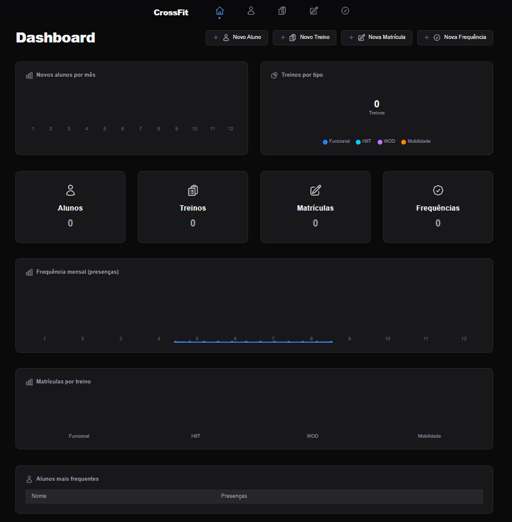
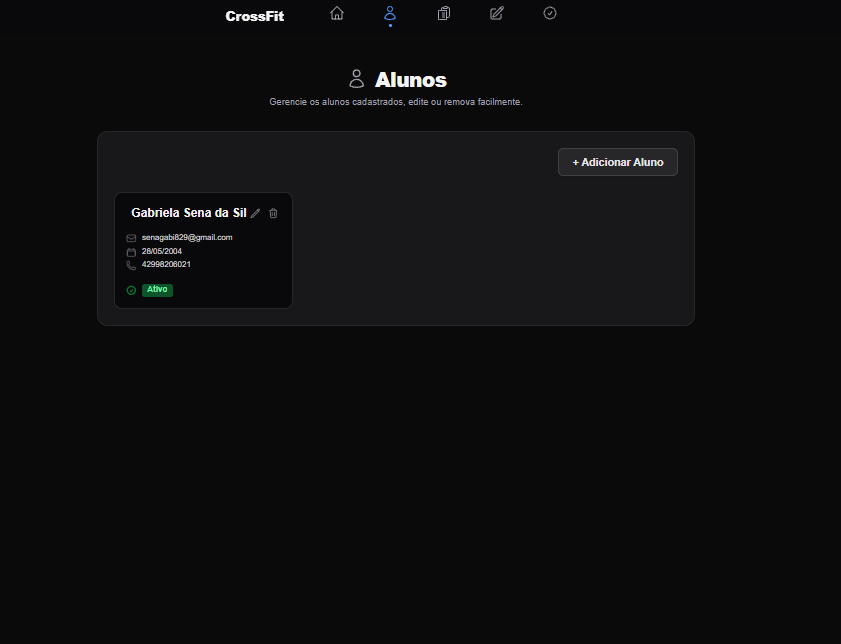
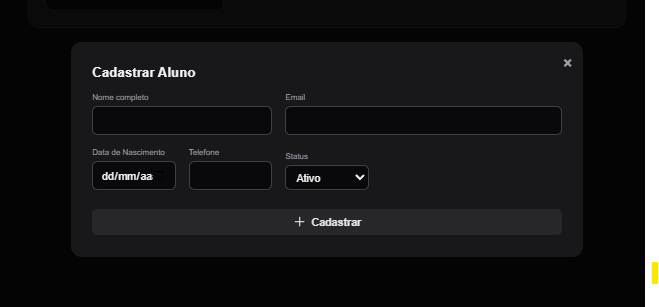
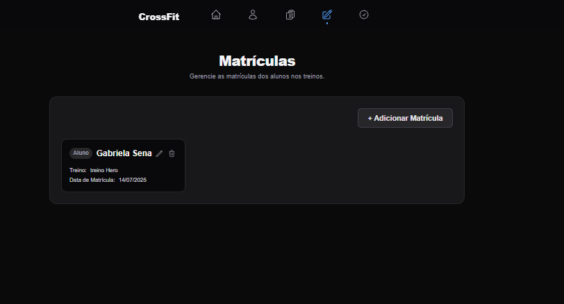
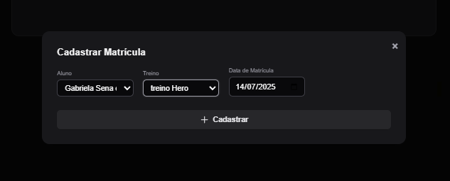
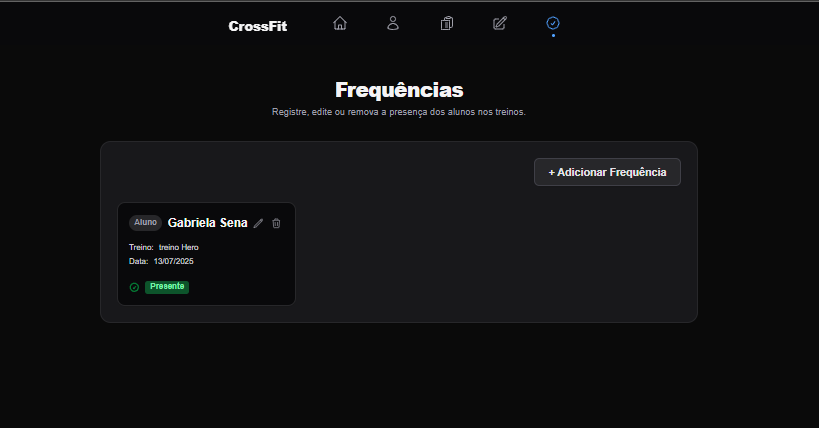
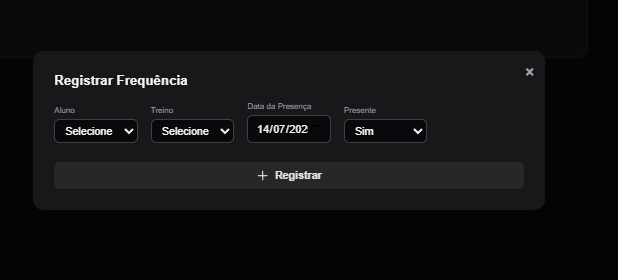
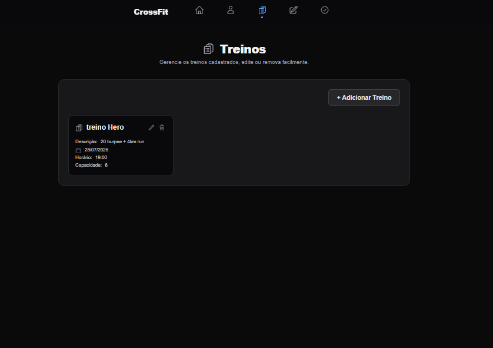
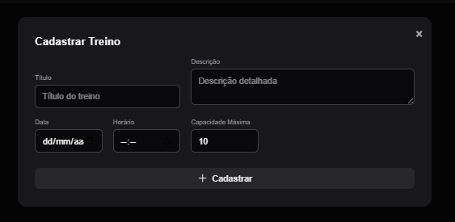

# Crossfit Web Frontend

## Tecnologias Utilizadas

- [Next.js](https://nextjs.org/)
- [React](https://react.dev/)
- [TypeScript](https://www.typescriptlang.org/)
- [Tailwind CSS](https://tailwindcss.com/)
- [Axios](https://axios-http.com/)
- [Heroicons](https://heroicons.com/)

## Scripts de Execução

Instale as dependências do projeto:

```bash
npm install
```

Para rodar o servidor de desenvolvimento:

```bash
npm run dev
```

Para gerar o build de produção:

```bash
npm run build
```

Para iniciar o servidor em produção:

```bash
npm start
```

Para rodar o linter:

```bash
npm run lint
```

Acesse [http://localhost:3001](http://localhost:3001) no seu navegador para ver a aplicação rodando.

## Prints da Aplicação

Adicione prints da aplicação aqui:

### Página Inicial


### Alunos


### Cadastro de Alunos


### Matrículas


### Cadastrar Matrícula


### Frequências


### Cadastro de Frequências


### Treinos


### Cadastro de Treinos


## Estrutura do Projeto

- As páginas estão localizadas em `app/`
- Componentes reutilizáveis em `components/`
- Estilos globais em `app/globals.css`

## Observações

Este projeto foi criado com [`create-next-app`](https://nextjs.org/docs/app/api-reference/cli/create-next-app).

---

Para mais informações, consulte a [documentação do Next.js](https://nextjs.org/docs).
